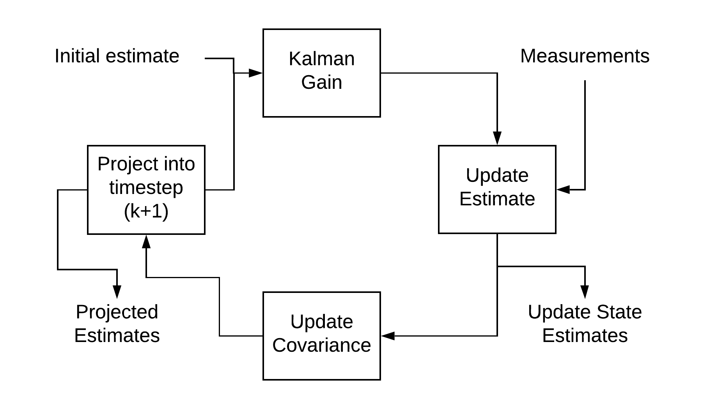
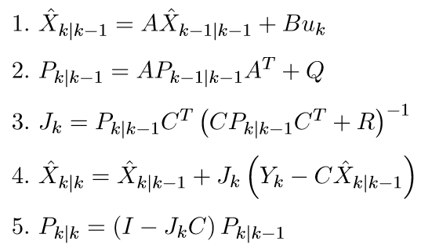
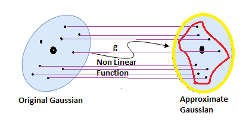

## Mini Project 1

**Team Members:**

Raj Shinde (M.Eng. Robotics) - 116852104

Shubham Sonawane (M.Eng. Robotics) - 116808996

### Introduction to Kalman Filters

Kalman filter is a powerful tool for combining information in presence of information uncertainty. It can be used in any place where the information about the system is uncertain. It is used to make an educated guess of what the system will do in the next time-step.

Kalman filter is an ideal tool for systems that are continuously changing. The simple calculations involved means that the speed is an advantage, making it an ideal candidate for real-time systems to be implemented on embedded platform.  

Since Kalman filters work recursively, they do not need the complete history of the system, only the information from previous time step is required. 

### Formal Definition

The Kalman filter requires the following information to run its algorithm:

1.	Model of the system in state space(A,B,C matrices)
2.	Input of each time step
3.	Sensor measurements
4.	Initial system state and covariance (the initial state is the best estimate of the starting point, and it is a good practice to have a large covariance matrix initially)
5.	Measurement noise covariance, which is usually calculated offline by taking a sensor and comparing it against a known value. 
6.	Model/input covariance, it is used as a tuning mechanism to optimize the filter performance. 

The Kalman filter follows a predict-update cycle to arrive at a state measurement. In the prediction phase, the state estimate at the previous timestep is used to make an estimate of the state at the current timestep. However, the state calculated in this step does not account for the sensor measurements or information from the current time step. In the update state, the state estimate from the previous step and the sensor measurements are combined, which improves the state estimate. 

The conditions under which the Kalman filter is known to produce optimal results are:
1.	The input noise and sensor noise are independent , and uncorrelated in time with each other
2.	The input noise and measurement noise both follow gaussian distribution. 
3.	System is linear.

In the above equations, Q is the model/input noise covariance matrix. R denotes the measurement noise covariance matrix. J is the gain matrix. Matrices A, B and C are 
obtained from the state space representation of the system. 

Kalman filter operates in 2 stages, time update and measurement update. 

1.	Time update: Before starting the iterations for Kalman filter, it is necessary to enter the estimate of the state variable vector and the error covariance matrix. The time update activity involves 2 primary equations. (1) calculates the a priori estimate of the state variable vector. This is the estimate of the state at given time step k when the system measurements upto time step k-1 are known. (2) updates the error covariance matrix P. 

2.	Measurement update: (3) calculates the Kalman gain K, denoted here by J which helps in reducing the error covariance matrix P. (4) calculates the estimate of the state at time k given measurement data upto time k. (5) calculates the error covariance matrix P (posteriori)

### Key Results

### Application in decision making for robots
Since decision making is a process of taking actions based on the current and the goal state. It becomes necessary to know the current state of the system. Kalman filters can be helpful here, when the current state of the robot is not precisely known. [1] Best shows how a kalman filter based algorithm assists a POMDP.

### Overview of the important applications

Kalman Filter is used in a variety of systems for tracking, trajectory prediction, perception and many more. One of the most important applications of Kalman Filter is the Localization in Robotics.

In robot localization, the landmarks or the environment features are known but the robot position isn’t. If the robot position is calculated using trigonometry and sensor inputs or by dead-reckoning, then it may seem like the robot is jumping around the area. Kalman filter is better in such applications, as it models the uncertainty of the sensor measurements as well. 

### Variants

**Extended Kalman Filter**-

Extended kalman filter is brought into action when the system to be worked on is nonlinear. In EKF, the nonlinear system is translated into a system of linear equations using multivariate taylor series expansion. This linearization is done around the current model estimate, and the multiple variables are used to form the Jacobian. These Jacobian matrices for each current state are’then used in the Kalman filter equations to compute the next estimate. 

**Unscented Kalman Filter**-

The Unscented Kalman Filter(UKF) unlike EKF uses a deterministic sampling approach instead of calculus technique like taylor series expansion. The deterministic sampling in UKF is used to choose points from source gaussian distribution, which are called as sigma points. These sigma points are  passed through the non linear function and then are used to calculate the new mean and variance for next estimate. In short, the current gaussian is mapped to a new approximation by passing it shough the non linear equations. More the number the sigma points, more is the precision, but is also increases the computation time.

Summing it all, We use Kalman filters as an estimator for a linear system. But as we start dealing with nonlinear systems, we use EKF and UKF. Especially UKF when we want more precision and performance optimization. 

### Open research problems

Although Kalman filters are being widely used in various domains, the problem of selecting the optimal initial values still remains. The process noise covariance matrix has a significant impact on the value predicted by the Kalman Filter. However, the process developed for estimating the initial value of covariance matrix does not work as desired for non-linear or complex systems. Therefore, researchers have developed an adaptive Kalman Filter based on reinforcement learning, which addresses this problem. 

### References
[1]  1. Sardag A, Akin HL. Kalman Based Finite State Controller for Partially Observable Domains. International Journal of Advanced Robotic Systems. December 2006. doi:10.5772/5723
  

[2]  S. Y. Chen, "Kalman Filter for Robot Vision: A Survey," in IEEE Transactions on Industrial Electronics, vol. 59, no. 11, pp. 4409-4420, Nov. 2012, doi: 10.1109/TIE.2011.2162714.

[3]  “Deep Robust Kalman Filter” S.D. Shashua, S. Mannor, Mar. 2017

[4]  https://towardsdatascience.com/the-unscented-kalman-filter-anything-ekf-can-do-i-can-do-it-better-ce7c773cf88d#:~:text=Basic%20Difference%20between%20EKF%20and,precise%20our%20approximation%20will%20be!
